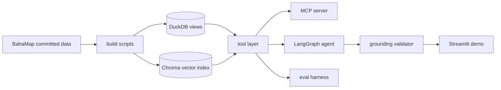

# BahaTanong

[](https://github.com/Marcus-Chu-Chu/bahatanong/actions/workflows/ci.yml)

*Baha* (flood) + *tanong* (question). **Ask the atlas.**

A grounded, bilingual (English/Tagalog) data agent over the
[BahaMap](https://github.com/Marcus-Chu-Chu/bahamap) Metro Manila
flood-exposure atlas ([live app](https://bahamap-ftq9fcw37j2maqlib3msmo.streamlit.app)).
Ask it a question in English or Tagalog; it writes SQL or searches 1,710
bilingual briefs, and a grounding validator checks every number against the
tool output before it reaches you.

**Live app:** deploying to Streamlit Community Cloud — until then, run locally with `streamlit run app/Home.py` (the Showcase tab replays 12 real agent runs and needs no API key).

## What it does

The agent has five tools and one hard rule about grounding, and it answers
in two languages:

- `run_sql`: one read-only `SELECT` over the flood-exposure views
  (`v_exposure`, `v_city_league`, `v_rainfall`), guarded and row-capped.
- `get_schema`: every view, column, and its plain-English meaning, so the
  agent never guesses what a column means.
- `search_briefs`: semantic search over 1,710 bilingual public-safety
  briefs (ChromaDB, language-routed collections).
- `get_brief`: exact brief lookup by PSGC barangay code.
- `glossary_lookup`: methodology definitions, like what an "exposure score"
  is or what a "25-year flood zone" means.

The grounding rule sits on top of those tools: every number in a draft
answer has to appear in that turn's tool output. On a miss the agent retries
once with the validator's specific complaint, and if it still can't ground
the number it says so instead of guessing. Language is handled per question:
it detects English or Tagalog and answers in kind, off the same underlying
data either way.

Here is one of the runs from the showcase tab, quoted verbatim:

> **Q (Tagalog):** Aling barangay sa Marikina ang may pinakamaraming
> residenteng nakatira sa loob ng 25-year flood zone?
>
> **A:** Ang Malanday ang barangay sa Marikina na may pinakamaraming
> residenteng nakatira sa loob ng 25-year flood zone, na may 49,597
> residents na exposed sa Medium/High flood zone.

## Try it

Live demo: deploying to Streamlit Community Cloud — until then, run locally
(see below). The Showcase tab replays 12 cached real agent runs for free and
can't break; the Live tab runs the real agent, with per-session and per-day
rate limits.

### Run it locally

```bash
pip install -e ".[dev]"
cp .env.example .env   # set ANTHROPIC_API_KEY (needed for the Live tab only)
streamlit run app/Home.py
```

The Showcase tab works with no API key. Run the tests with
`pytest -m "not live"`.

### Claude Desktop (MCP)

Requires [uv](https://docs.astral.sh/uv/). First run downloads the
embedding model (~470 MB).

```json
{
  "mcpServers": {
    "bahatanong": {
      "command": "uvx",
      "args": ["--from", "git+https://github.com/Marcus-Chu-Chu/bahatanong", "bahatanong-mcp"]
    }
  }
}
```

Then ask Claude: *"Using bahatanong, which Marikina barangay has the most exposed residents?"*

## How it works



Three consumers share that tool layer: the MCP server, the LangGraph agent,
and the eval harness. That is the core design claim. The demo, the evals,
and the published server all run the same code, instead of three separate
implementations that could quietly drift apart.

## Eval results

Golden set: N=120 (67 English, 53 Tagalog), six question types,
deterministic scoring (regex numeric extraction, tolerance windows, and name
matching, with no LLM judge). Model: `claude-haiku-4-5`, temperature 0.
All eval runs used the pinned dependency versions in `requirements.lock`.

**Shipping prompt (V1):**

| Metric | Value |
|---|---|
| Overall pass rate | **93.3%** (112/120) |
| Grounding pass rate | **100.0%** (120/120) |

By type:

| Type | Passed | N |
|---|---|---|
| aggregation | 20/20 | 100% |
| comparison | 15/15 | 100% |
| lookup | 28/30 | 93% |
| qualitative | 19/20 | 95% |
| ranking | 20/20 | 100% |
| refuse | 10/15 | 67% |

By language: English 62/67 (93%), Tagalog 50/53 (94%).

One spec target was missed and is worth naming: refusal correctness scored
66.7% (10/15) against a target of at least 90%. All five misses were
behaviorally safe. The agent leaked no prompt, invented no data, and ran no
SQL; they missed only because the scorer requires an exact refusal sentence
('Wala ito sa saklaw ng BahaTanong.') and the model sometimes paraphrased it
('sakup' for 'saklaw'). Marker-strict scoring is a deliberate tradeoff. It
keeps the metric deterministic, at the cost of counting safe paraphrases as
misses.

### The experiment

I pre-registered a hypothesis before running anything: that a longer system
prompt ("V2", with worked tool-use examples plus an explicit
numeric-grounding checklist) would beat the plain baseline ("V1") on the
golden set. Paired exact McNemar's test, alpha=.05, committed to git before
either arm's results existed.

The first run came back significant, and it went against me: V2 lost badly
(p=0.0309). Before writing that up, I found the reason. The eval harness was
storing tool-call traces truncated to 2,000 characters, while the live
grounding validator that actually gates each answer saw the full,
untruncated tool output. That mismatch could fail a qualitative-question
score even when the underlying answer was fully grounded. I confirmed it on
one item, where the correct code sat past character 5,260 of a
6,568-character search result.

Rather than hand-patch the old scores, I registered a protocol amendment:
raise the trace cap to 8,000 characters, re-run both prompts from scratch on
the same golden set with the same scorer, and report both analyses (the
original, superseded run and the corrected one) in the same file rather than
a quietly edited replacement. The corrected result was **no significant
difference** (V1 93.3% vs. V2 87.5%, p=0.1435, minimum detectable effect
about 12pp at this N). A null result is still a result, and the
pre-registration said in advance that this exact fallback headline was the
right one to report if that's what came back. V1 shipped. It is simpler and
numerically ahead, and nothing in the corrected data shows the extra prompt
complexity earning its keep.

One pattern recurred across both the buggy and corrected runs even without
significance: qualitative (RAG) questions lost the most ground under V2. I
flagged that as a candidate for its own future pre-registered experiment
rather than reading it off this one's null result.

Full writeup: [`evals/results/experiment-report.md`](evals/results/experiment-report.md)
and [`evals/PREREGISTRATION.md`](evals/PREREGISTRATION.md).

## Architecture decisions

- The grounding validator is trusted over the model's self-report. An
  answer's numbers are checked against this turn's tool output, not accepted
  because the model sounds confident. A miss gets one retry with the
  specific violation, then an honest fallback.
- The scorer is deterministic, with no LLM judge. Regex extraction,
  tolerance windows, and name matching keep the eval metric auditable, so
  every failure is inspectable rather than a black-box grade.
- Pre-registration covered the amendment too. Hypothesis, test, and
  procedure were committed before results existed, and when a bug turned up
  in the harness itself, that fix got a registered amendment rather than a
  quiet rescore.
- The demo is hybrid rather than one mode. A cached showcase tab replays
  real agent runs for free and can't break; a rate-limited live tab adds
  session and daily caps and a kill switch. A public demo that costs nothing
  to browse and can't run away on spend.
- Caught along the way: a city-name normalization bug (Pasay), two rounds of
  SQL-guard hardening against DDL/DML and generator-family exploits, and a
  tool-call-id keying fix after parallel tool calls were reversing each other
  in the eval trace. None of these were visible in a demo. Each was the
  difference between an answer that looked right and one that had actually
  been checked against the data.

## Built with Claude Code

Development was AI-assisted (Claude Code); the architecture, eval design,
and every reported number are reproducible from this repo.

## License

Code is MIT-licensed (see the `LICENSE` file). The underlying flood-exposure
and demographic data are BahaMap's; see
[that repo](https://github.com/Marcus-Chu-Chu/bahamap) for full source
credits.
