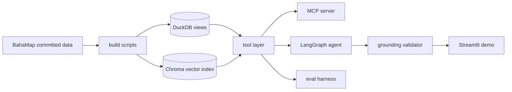

# BahaTanong

*Baha* (flood) + *tanong* (question). **Ask the atlas.**

A grounded, bilingual (English/Tagalog) data agent over the
[BahaMap](https://github.com/Marcus-Chu-Chu/bahamap) Metro Manila
flood-exposure atlas ([live app](https://bahamap-ftq9fcw37j2maqlib3msmo.streamlit.app)).
Ask it a question in English or Tagalog; it writes SQL or searches 1,710
bilingual briefs, and a grounding validator checks every number against the
tool output before it reaches you.

**Live app:** `<LIVE_APP_URL — inserted at T15 deploy>`

<!-- Demo GIF: docs/launch/demo.gif — recorded and embedded at Task 16 Step 4 -->

## What it does

Five tools, one grounding rule, two languages:

- **`run_sql`** — one read-only `SELECT` over the flood-exposure views
  (`v_exposure`, `v_city_league`, `v_rainfall`), guarded and row-capped
- **`get_schema`** — every view, column, and its plain-English meaning, so
  the agent never guesses what a column means
- **`search_briefs`** — semantic search over 1,710 bilingual public-safety
  briefs (ChromaDB, language-routed collections)
- **`get_brief`** — exact brief lookup by PSGC barangay code
- **`glossary_lookup`** — methodology definitions (what an "exposure score"
  is, what a "25-year flood zone" means, and so on)
- **Grounding validator** — every number in a draft answer must appear in
  that turn's tool output; one retry with the validator's specific
  complaint injected, then a "couldn't verify" fallback rather than a guess
- **Bilingual by design** — detects English vs. Tagalog per question and
  answers in kind, off the same underlying data either way

A real showcase run (not a mock):

> **Q (Tagalog):** Aling barangay sa Marikina ang may pinakamaraming
> residenteng nakatira sa loob ng 25-year flood zone?
>
> **A:** Ang Malanday ang barangay sa Marikina na may pinakamaraming
> residenteng nakatira sa loob ng 25-year flood zone, na may 49,597
> residents na exposed sa Medium/High flood zone.

## Try it

**Live demo:** `<LIVE_APP_URL — inserted at T15 deploy>` — a Showcase tab
(12 cached real agent runs, $0, instant, can't break) and a Live tab (the
real agent, session- and daily-rate-limited).

### Claude Desktop (MCP)

Requires [uv](https://docs.astral.sh/uv/). First run downloads the
embedding model (~470 MB).

```json
{
  "mcpServers": {
    "bahatanong": {
      "command": "uvx",
      "args": ["--from", "git+https://github.com/Marcus-Chu-Chu/bahatanong", "bahatanong-mcp"]
    }
  }
}
```

Then ask Claude: *"Using bahatanong, which Marikina barangay has the most exposed residents?"*

## How it works



Three consumers — the MCP server, the LangGraph agent, and the eval
harness — share that same tool layer. That's the core design claim: the
demo, the evals, and the published server all exercise the same code
instead of three implementations that could quietly drift apart.

## Eval results

Golden set: N=120 (67 English / 53 Tagalog), six question types,
deterministic scoring (regex numeric extraction + tolerance windows + name
matching — no LLM judge). Model: `claude-haiku-4-5`, temperature 0.

**Shipping prompt (V1):**

| Metric | Value |
|---|---|
| Overall pass rate | **93.3%** (112/120) |
| Grounding pass rate | **100.0%** (120/120) |

By type:

| Type | Passed | N |
|---|---|---|
| aggregation | 20/20 | 100% |
| comparison | 15/15 | 100% |
| lookup | 28/30 | 93% |
| qualitative | 19/20 | 95% |
| ranking | 20/20 | 100% |
| refuse | 10/15 | 67% |

By language: English 62/67 (93%) · Tagalog 50/53 (94%)

One spec target was missed and is worth naming: refusal correctness scored 66.7% (10/15) against a ≥90% target. All five misses were behaviorally safe — no prompt leak, no invented data, no SQL executed — but the scorer requires an exact refusal sentence ('Wala ito sa saklaw ng BahaTanong.') and the model sometimes paraphrased it ('sakup' for 'saklaw'). Marker-strict scoring is a deliberate tradeoff: it keeps the metric deterministic, at the cost of counting safe paraphrases as misses.

### The experiment

I pre-registered a hypothesis before running anything: that a longer system
prompt ("V2" — worked tool-use examples plus an explicit numeric-grounding
checklist) would beat the plain baseline ("V1") on the golden set. Paired
exact McNemar's test, alpha=.05, committed to git before either arm's
results existed.

The first run came back significant — V2 lost, badly (p=0.0309). Before
writing that up, I found the reason: the eval harness was storing tool-call
traces truncated to 2,000 characters, while the live grounding validator
that actually gates each answer saw the full, untruncated tool output. That
mismatch could fail a qualitative-question score even when the underlying
answer was fully grounded — confirmed on one item, where the correct code
sat past character 5,260 of a 6,568-character search result.

Rather than hand-patch the old scores, I registered a protocol amendment
(raise the trace cap to 8,000 characters, re-run both prompts from scratch,
same golden set, same scorer) and reported both analyses — the original,
superseded run and the corrected one — in the same file, not a quietly
edited replacement. The corrected result: **no significant difference**
(V1 93.3% vs. V2 87.5%, p=0.1435, minimum detectable effect ≈12pp at this
N). A null result is still a result, and the pre-registration said in
advance that this exact fallback headline was the correct one to report if
that's what came back. V1 shipped — it's simpler and numerically ahead,
and nothing in the corrected data shows the extra prompt complexity earning
its keep.

One pattern recurred across both the buggy and corrected runs even without
significance: qualitative (RAG) questions lost the most ground under V2.
That's flagged as a candidate for its own future pre-registered experiment,
not read off this one's null result.

Full writeup: [`evals/results/experiment-report.md`](evals/results/experiment-report.md)
· [`evals/PREREGISTRATION.md`](evals/PREREGISTRATION.md)

## Architecture decisions

- **Grounding validator over LLM self-report.** An answer's numbers are
  checked against this turn's tool output, not trusted because the model
  sounds confident; one retry with the specific violation, then an honest
  fallback.
- **Deterministic scorer, no LLM judge.** Regex extraction + tolerance
  windows + name matching keeps the eval metric auditable — every failure
  is inspectable, not a black-box grade.
- **Pre-registration, including the amendment.** Hypothesis, test, and
  procedure were committed before results existed; when a bug turned up in
  the harness itself, that got a registered amendment too, not a quiet
  rescore.
- **Hybrid demo, not one mode.** A cached showcase tab (real agent runs,
  replayed, $0, can't break) plus a rate-limited live tab (session and
  daily caps, kill switch) — a public demo that costs nothing to browse
  and can't run away on spend.
- **Caught along the way:** a city-name normalization bug (Pasay), two
  rounds of SQL-guard hardening against DDL/DML and generator-family
  exploits, and a tool-call-id keying fix after parallel tool calls were
  reversing each other in the eval trace. None of these were needed to
  ship something that *looked* done — they were needed to ship something
  that was actually grounded.

## Built with Claude Code

Built with [Claude Code](https://claude.com/claude-code) driving an
approved spec and 16-task plan (`docs/superpowers/`), with a pre-registered
experiment, deterministic evals, and a review pass between tasks.

## License

Code is MIT-licensed (see `pyproject.toml`). Underlying flood-exposure and
demographic data are BahaMap's — see [that repo](https://github.com/Marcus-Chu-Chu/bahamap)
for full source credits.
